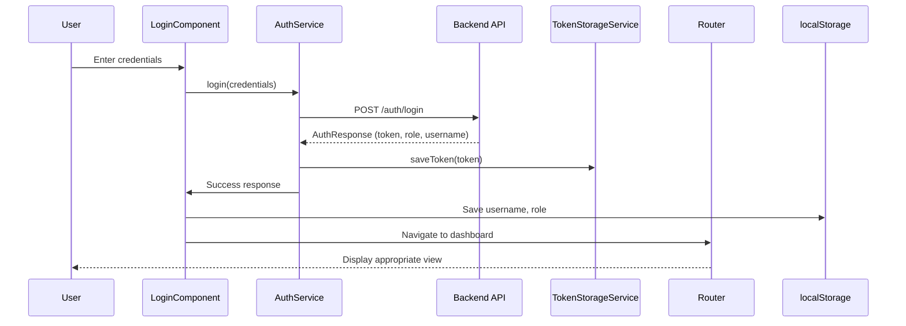

## Overview

Biblioteca Virtual implements JWT (JSON Web Token) authentication to secure API communications. The authentication system handles user login, registration, session management, and automatic token injection into HTTP requests.

## Authentication Architecture

<Steps>
  <Step title="User Login">
    User submits credentials through the login form
  </Step>
  
  <Step title="JWT Token Received">
    Backend validates credentials and returns JWT token with user data
  </Step>
  
  <Step title="Session Storage">
    Token and user data are stored in localStorage
  </Step>
  
  <Step title="Automatic Token Injection">
    HTTP interceptor adds token to all outgoing requests
  </Step>
  
  <Step title="Protected Route Access">
    Guards verify token presence before allowing route navigation
  </Step>
</Steps>

## AuthService

The `AuthService` manages all authentication operations:

```typescript src/app/auth/auth.service.ts
import { Injectable } from '@angular/core';
import { HttpClient } from '@angular/common/http';
import { Observable } from 'rxjs';
import { TokenStorageService } from '../core/services/token-storage.service';
import { AuthResponse, AuthRequest } from '../core/models/auth.interface';
import { environment } from '../../environments/environment';

@Injectable({
  providedIn: 'root',
})
export class AuthService {
  private API_URL = `${environment.apiUrl}/auth`;

  constructor(
    private http: HttpClient,
    private tokenStorage: TokenStorageService
  ) {}

  // Login
  login(usuario: AuthRequest): Observable<AuthResponse> {
    return this.http.post<AuthResponse>(`${this.API_URL}/login`, usuario);
  }

  // Register
  register(usuario: AuthRequest): Observable<any> {
    return this.http.post(`${this.API_URL}/register`, usuario, {
      responseType: 'text',
    });
  }

  // Save token and user data
  saveSession(response: AuthResponse): void {
    this.tokenStorage.saveToken(response.token);
    localStorage.setItem('username', response.username);
    localStorage.setItem('role', response.role);
  }

  // Logout
  logout(): void {
    this.tokenStorage.signOut();
    localStorage.removeItem('username');
    localStorage.removeItem('role');
  }

  // Role verification
  isAdmin(): boolean {
    return localStorage.getItem('role') === 'ROLE_ADMIN';
  }

  isUser(): boolean {
    return localStorage.getItem('role') === 'ROLE_USER';
  }
}
```

### Key Methods

<Tabs>
  <Tab title="login()">
    Sends username and password to the backend `/auth/login` endpoint.
    
    ```typescript
    login(usuario: AuthRequest): Observable<AuthResponse>
    ```
    
    **Parameters:**
    - `usuario` - Object containing `username` and `password`
    
    **Returns:**
    - Observable of `AuthResponse` with token and user data
  </Tab>
  
  <Tab title="register()">
    Creates a new user account.
    
    ```typescript
    register(usuario: AuthRequest): Observable<any>
    ```
    
    **Parameters:**
    - `usuario` - Object containing `username` and `password`
    
    **Returns:**
    - Observable with text response from server
  </Tab>
  
  <Tab title="saveSession()">
    Stores JWT token and user metadata in localStorage.
    
    ```typescript
    saveSession(response: AuthResponse): void
    ```
    
    **Stores:**
    - JWT token (via TokenStorageService)
    - Username
    - User role (`ROLE_ADMIN` or `ROLE_USER`)
  </Tab>
  
  <Tab title="logout()">
    Clears all authentication data.
    
    ```typescript
    logout(): void
    ```
    
    **Removes:**
    - JWT token
    - Username
    - User role
  </Tab>
</Tabs>

## Authentication Interfaces

Type-safe authentication data structures:

```typescript src/app/core/models/auth.interface.ts
export interface AuthRequest {
  username: string;
  password: string;
}

export interface AuthResponse {
  token: string;
  tipoToken: string;
  username: string;
  role: string;
}
```

<Info>
  The `role` field contains either `ROLE_ADMIN` or `ROLE_USER`, which is used throughout the application for authorization decisions.
</Info>

## TokenStorageService

Manages JWT token persistence in localStorage:

```typescript src/app/core/services/token-storage.service.ts
import { Injectable } from '@angular/core';

const TOKEN_KEY = 'auth-token';

@Injectable({
  providedIn: 'root',
})
export class TokenStorageService {
  // Save token
  saveToken(token: string): void {
    window.localStorage.removeItem(TOKEN_KEY);
    window.localStorage.setItem(TOKEN_KEY, token);
  }

  // Get token
  getToken(): string | null {
    return window.localStorage.getItem(TOKEN_KEY);
  }

  // Remove token
  signOut(): void {
    window.localStorage.removeItem(TOKEN_KEY);
  }

  // Check if user is logged in
  isLoggedIn(): boolean {
    return this.getToken() !== null;
  }
}
```

### Token Storage Methods

| Method | Description | Returns |
|--------|-------------|---------|
| `saveToken(token)` | Stores JWT token in localStorage | `void` |
| `getToken()` | Retrieves current token | `string \| null` |
| `signOut()` | Removes token from storage | `void` |
| `isLoggedIn()` | Checks if token exists | `boolean` |

## HTTP Interceptor

The `authInterceptor` automatically attaches JWT tokens to all outgoing HTTP requests:

```typescript src/app/core/interceptors/auth-interceptor.ts
import { inject } from '@angular/core';
import { HttpInterceptorFn } from '@angular/common/http';
import { TokenStorageService } from '../services/token-storage.service';

export const authInterceptor: HttpInterceptorFn = (req, next) => {
  const tokenStorage = inject(TokenStorageService);
  const token = tokenStorage.getToken();

  if (!token) {
    return next(req);
  }

  // Add token to request header
  const clonedRequest = req.clone({
    setHeaders: {
      Authorization: `Bearer ${token}`,
    },
  });

  return next(clonedRequest);
};
```

<Steps>
  <Step title="Interceptor Invoked">
    Every HTTP request triggers the interceptor
  </Step>
  
  <Step title="Token Retrieved">
    Gets JWT token from TokenStorageService
  </Step>
  
  <Step title="Header Added">
    If token exists, clones request and adds `Authorization: Bearer <token>` header
  </Step>
  
  <Step title="Request Sent">
    Modified request is sent to the backend
  </Step>
</Steps>

<Note>
  The interceptor is registered globally in `app.config.ts`:
  ```typescript
  provideHttpClient(withFetch(), withInterceptors([authInterceptor]))
  ```
</Note>

## Login Flow Example

Complete implementation of the login process:

```typescript Login Component Example
import { Component } from '@angular/core';
import { Router } from '@angular/router';
import { AuthService } from '../auth.service';
import { AuthRequest } from '../../core/models/auth.interface';

export class LoginComponent {
  private authService = inject(AuthService);
  private router = inject(Router);
  
  username = '';
  password = '';
  errorMessage = '';

  onSubmit() {
    const credentials: AuthRequest = {
      username: this.username,
      password: this.password
    };

    this.authService.login(credentials).subscribe({
      next: (response) => {
        // Save session data
        this.authService.saveSession(response);
        
        // Redirect based on role
        if (response.role === 'ROLE_ADMIN') {
          this.router.navigate(['/libros']);
        } else {
          this.router.navigate(['/catalogo']);
        }
      },
      error: (err) => {
        this.errorMessage = 'Credenciales inválidas';
        console.error('Login error:', err);
      }
    });
  }
}
```

### Login Sequence Diagram



## Registration Flow

User registration follows a similar pattern:

```typescript Registration Example
onRegister() {
  const newUser: AuthRequest = {
    username: this.username,
    password: this.password
  };

  this.authService.register(newUser).subscribe({
    next: (response) => {
      console.log('Registration successful:', response);
      // Redirect to login
      this.router.navigate(['/auth/login']);
    },
    error: (err) => {
      this.errorMessage = 'Error en el registro';
      console.error('Registration error:', err);
    }
  });
}
```

<Warning>
  Registration does NOT automatically log the user in. After successful registration, redirect to the login page.
</Warning>

## Logout Implementation

Logout clears all session data and redirects to login:

```typescript Logout Example
logout() {
  this.authService.logout();
  this.router.navigate(['/auth/login']);
}
```

## Session Persistence

Authentication data is stored in `localStorage`, making sessions persist across browser refreshes:

### Stored Data

| Key | Value | Purpose |
|-----|-------|---------|
| `auth-token` | JWT string | API authentication |
| `username` | User's username | Display in UI |
| `role` | `ROLE_ADMIN` or `ROLE_USER` | Authorization decisions |

### Checking Authentication Status

```typescript
// Check if user is logged in
const isLoggedIn = this.tokenStorageService.isLoggedIn();

// Check user role
const isAdmin = this.authService.isAdmin();
const isUser = this.authService.isUser();
```

## Error Handling

Handle authentication errors gracefully:

```typescript Error Handling Pattern
this.authService.login(credentials).subscribe({
  next: (response) => {
    // Success handling
    this.authService.saveSession(response);
    this.router.navigate(['/catalogo']);
  },
  error: (err) => {
    if (err.status === 401) {
      this.errorMessage = 'Credenciales inválidas';
    } else if (err.status === 0) {
      this.errorMessage = 'No se puede conectar al servidor';
    } else {
      this.errorMessage = 'Error desconocido';
    }
  }
});
```

## Security Considerations

<CardGroup cols={2}>
  <Card title="Token Expiration" icon="clock">
    JWT tokens have an expiration time set by the backend. Implement token refresh or force re-login on expiry.
  </Card>
  
  <Card title="HTTPS Only" icon="lock">
    Always use HTTPS in production to prevent token interception.
  </Card>
  
  <Card title="XSS Protection" icon="shield">
    Sanitize all user inputs to prevent token theft via XSS attacks.
  </Card>
  
  <Card title="Logout on Error" icon="right-from-bracket">
    Clear session if backend returns 401/403 errors on protected endpoints.
  </Card>
</CardGroup>

## Testing Authentication

Example unit tests for AuthService:

```typescript auth.service.spec.ts
describe('AuthService', () => {
  it('should login and return auth response', () => {
    const mockResponse: AuthResponse = {
      token: 'mock-jwt-token',
      tipoToken: 'Bearer',
      username: 'testuser',
      role: 'ROLE_USER'
    };

    service.login({ username: 'test', password: 'pass' }).subscribe(response => {
      expect(response).toEqual(mockResponse);
    });
  });

  it('should save session data', () => {
    const response: AuthResponse = {
      token: 'test-token',
      tipoToken: 'Bearer',
      username: 'testuser',
      role: 'ROLE_ADMIN'
    };

    service.saveSession(response);

    expect(localStorage.getItem('username')).toBe('testuser');
    expect(localStorage.getItem('role')).toBe('ROLE_ADMIN');
  });
});
```

## Next Steps

<CardGroup cols={2}>
  <Card title="Authorization Guards" href="/architecture/authorization" icon="shield-halved">
    Learn how guards use authentication to protect routes
  </Card>
  
  <Card title="Auth Service" href="/api/services/auth-service" icon="plug">
    Explore backend API endpoints
  </Card>
  
  <Card title="User Roles" href="/architecture/authorization" icon="users">
    Understand role-based features
  </Card>
  
  <Card title="Error Handling" href="/features/admin-panel" icon="triangle-exclamation">
    Implement robust error handling
  </Card>
</CardGroup>
